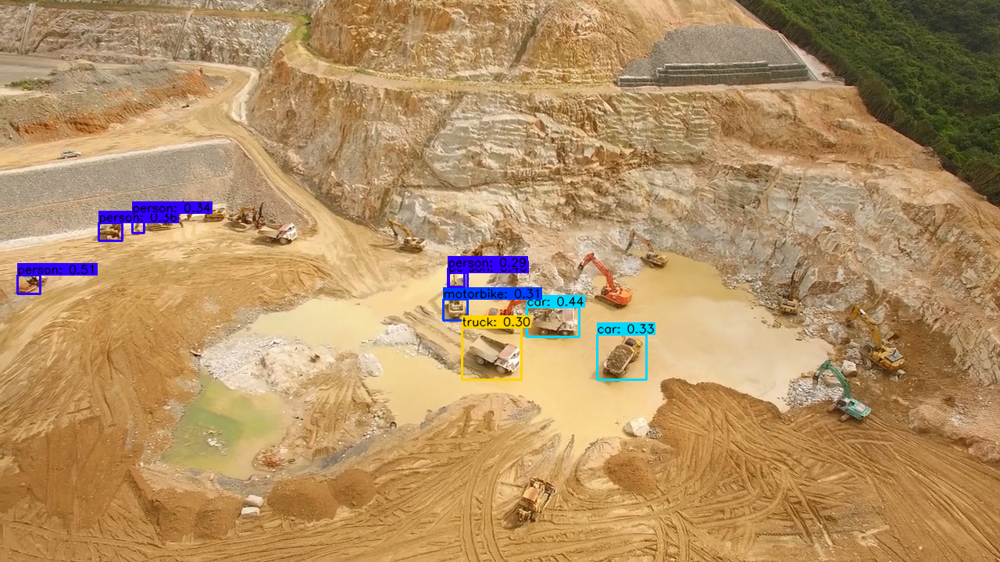
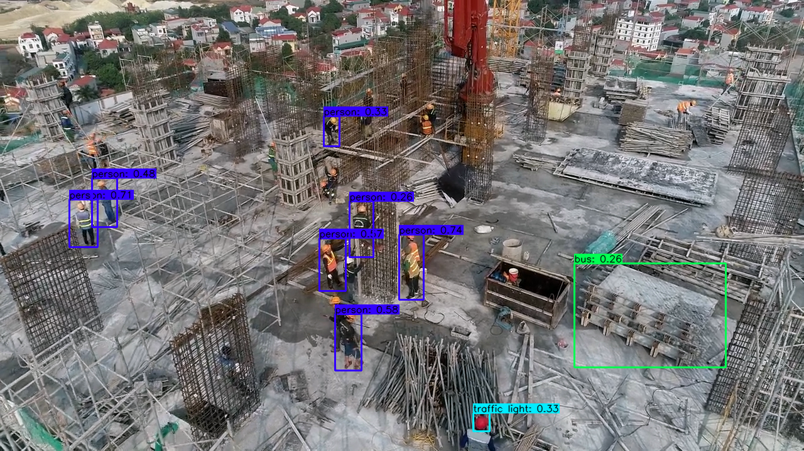
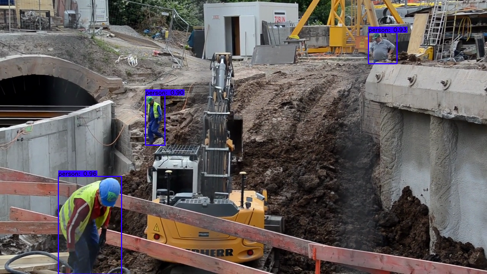
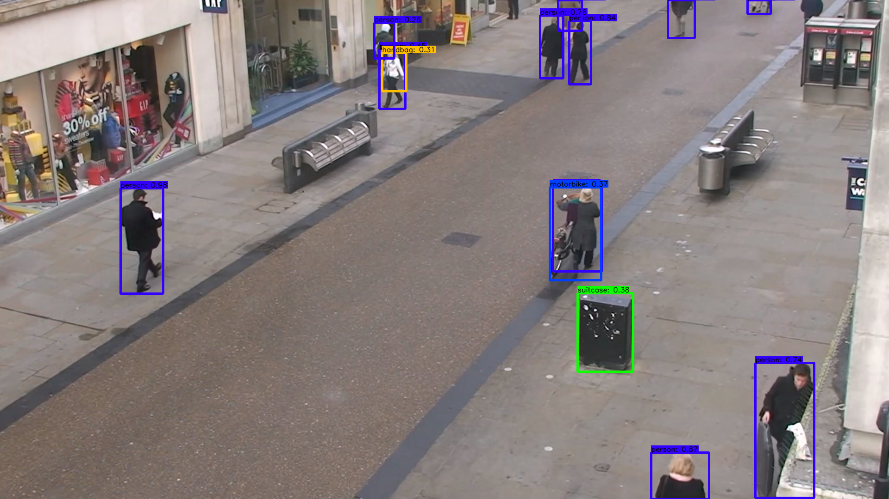

# Yolov4 TensorFlow & TF-Lite Quantization float16
[](LICENSE)

YOLOv4, YOLOv4-tiny Implemented in Tensorflow 2.0. 
Convert YOLO v4, YOLOv4 tiny .weights to .pb, .tflite and trt format for tensorflow, tensorflow lite.

Download yolov4.weights file: https://github.com/AlexeyAB/darknet/releases/download/darknet_yolo_v3_optimal/yolov4.weights

Download yolov4-tiny.weights file : https://github.com/AlexeyAB/darknet/releases/download/darknet_yolo_v4_pre/yolov4-tiny.weights


### Requirements
* python == 3.8.x
* Tensorflow == 2.3.1
* Numpy == 1.17.5
* matplotplib == 3.5.1
* opencv == 4.6.0

### Use GPU Desktop (NVIDIA)
* cudnn == 7.6.5
* cuda == 10.1
* Nvidia-GPU-Driver == 470.

### Preview
<p align="center"></p>

### How to Run
```bash
# Environment is Ubuntu 20.04.
# clone this git & follow this command

$ git clone https://github.com/yeoriee/yolov4_tflite.git
$ cd yolov4_tflite.git

# Convert darknet weights to tensorflow
## yolov4
python save_model.py --weights ./data/yolov4.weights --output ./checkpoints/yolov4-416 --input_size 416 --model yolov4 

# Run object detection
## image : detect.py
python detect.py --weights ./checkpoints/yolov4-416 --size 416 --model yolov4 --image ./data/construction_site_vehicle.jpg
## video : detectvideo.py
python detectvideo.py --weights ./checkpoints/yolov4-416 --size 416 --model yolov4 --video ./data/construction_site_vehicle.mp4

```

### YOLOv4 TensorFlow Output

##### YOLOv4 construction_site_vehicle 
<p align="left"></p>

#### construction_site_zoom
<p align="left"></p>

#### construction_site_poclain+person
<p align="left"></p>

#### person_test
<p align="left"></p>

### Convert to tflite

```bash
# Save tf model for tflite converting
python save_model.py --weights ./data/yolov4.weights --output ./checkpoints/yolov4-416 --input_size 416 --model yolov4 --framework tflite

# yolov4
python convert_tflite.py --weights ./checkpoints/yolov4-416 --output ./checkpoints/yolov4-416.tflite

# yolov4 quantize float16
python convert_tflite.py --weights ./checkpoints/yolov4-416 --output ./checkpoints/yolov4-416-fp16.tflite --quantize_mode float16

# Run demo tflite model
python detect.py --weights ./checkpoints/yolov4-416.tflite --size 416 --model yolov4 --image ./data/construction_site_vehicle.png --framework tflite
```


### YOLOv4 TF-Lite Output

##### construction_site_vehicle 
<p align="left"></p>

#### construction_site_zoom
<p align="left"></p>

#### construction_site_poclain+person
<p align="left"></p>

#### person_test
<p align="left"></p>


### Evaluate on COCO 2017 Dataset
```bash
# run script in /script/get_coco_dataset_2017.sh to download COCO 2017 Dataset
# preprocess coco dataset
cd data
mkdir dataset
cd ..
cd scripts
python coco_convert.py --input ./coco/annotations/instances_val2017.json --output val2017.pkl
python coco_annotation.py --coco_path ./coco 
cd ..

# evaluate yolov4 model
python evaluate.py --weights ./data/yolov4.weights
cd mAP/extra
python remove_space.py
cd ..
python main.py --output results_yolov4_tf
```
#### mAP50 on COCO 2017 Dataset

| Detection   | 512x512 | 416x416 | 320x320 |
|-------------|---------|---------|---------|
| YoloV3      | 55.43   | 52.32   |         |
| YoloV4      | 61.96   | 57.33   |         |

### Benchmark
```bash
python benchmarks.py --size 416 --model yolov4 --weights ./data/yolov4.weights
```
#### TensorRT performance
 
| YoloV4 416 images/s |   FP32   |   FP16   |   INT8   |
|---------------------|----------|----------|----------|
| Batch size 1        | 55       | 116      |          |
| Batch size 8        | 70       | 152      |          |

#### Tesla P100

| Detection   | 512x512 | 416x416 | 320x320 |
|-------------|---------|---------|---------|
| YoloV3 FPS  | 40.6    | 49.4    | 61.3    |
| YoloV4 FPS  | 33.4    | 41.7    | 50.0    |

#### Tesla K80

| Detection   | 512x512 | 416x416 | 320x320 |
|-------------|---------|---------|---------|
| YoloV3 FPS  | 10.8    | 12.9    | 17.6    |
| YoloV4 FPS  | 9.6     | 11.7    | 16.0    |

#### Tesla T4

| Detection   | 512x512 | 416x416 | 320x320 |
|-------------|---------|---------|---------|
| YoloV3 FPS  | 27.6    | 32.3    | 45.1    |
| YoloV4 FPS  | 24.0    | 30.3    | 40.1    |

#### Tesla P4

| Detection   | 512x512 | 416x416 | 320x320 |
|-------------|---------|---------|---------|
| YoloV3 FPS  | 20.2    | 24.2    | 31.2    |
| YoloV4 FPS  | 16.2    | 20.2    | 26.5    |

#### Macbook Pro 15 (2.3GHz i7)

| Detection   | 512x512 | 416x416 | 320x320 |
|-------------|---------|---------|---------|
| YoloV3 FPS  |         |         |         |
| YoloV4 FPS  |         |         |         |

### Traning your own model
```bash
# Prepare your dataset
# If you want to train from scratch:
In config.py set FISRT_STAGE_EPOCHS=0 
# Run script:
python train.py

# Transfer learning: 
python train.py --weights ./data/yolov4.weights
```
The training performance is not fully reproduced yet, so I recommended to use Alex's [Darknet](https://github.com/AlexeyAB/darknet) to train your own data, then convert the .weights to tensorflow or tflite.


### References

  * YOLOv4: Optimal Speed and Accuracy of Object Detection [YOLOv4](https://arxiv.org/abs/2004.10934).
  * [darknet](https://github.com/AlexeyAB/darknet)
  * [tensorflow-yolov4-tflite](https://github.com/hunglc007/tensorflow-yolov4-tflite)
